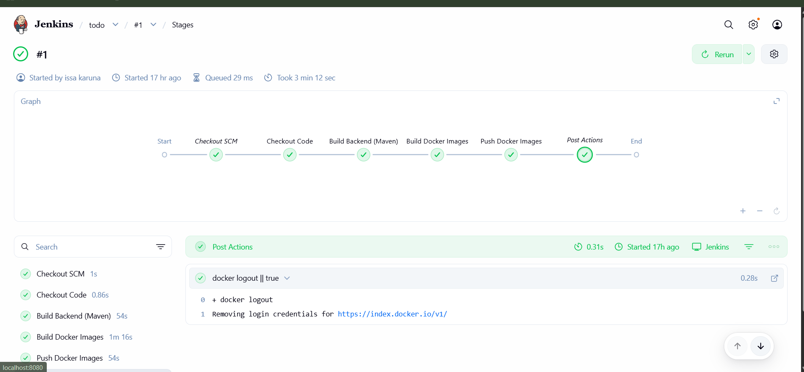

# Jenkins CI Pipeline

## Overview

This project uses **Jenkins** for Continuous Integration (CI).
The Jenkins pipeline is defined declaratively using a `Jenkinsfile` stored in the repository.

The pipeline is **automatically triggered via a GitHub webhook** whenever code is pushed to the repository.

---

## Pipeline Trigger (GitHub Webhook)

### Why Webhook Is Used

* Ensures **automatic CI execution** on every `git push`
* Avoids manual or polling-based triggers
* Matches real-world CI practices

### How It Works

1. A webhook is configured in the GitHub repository
2. On every push event:

   * GitHub sends a POST request to Jenkins
   * Jenkins immediately triggers the pipeline
3. No manual job execution is required

> This satisfies the requirement:
> **“CI should trigger automatically when code is pushed.”**

---

## Jenkins Pipeline Stages (Explanation)

### 1. **Checkout Source Code**

* Jenkins pulls the latest code from GitHub
* Uses repository-integrated SCM configuration
* Ensures pipeline always runs against the most recent commit

**Purpose:**
Guarantees CI consistency with source control.

---

### 2. **Build Backend Application**

* Backend code is compiled and packaged
* Ensures the application builds successfully before containerization

**Purpose:**
Fail fast if the application itself is broken.

---

### 3. **Build Docker Images**

* Separate Docker images are built for:

  * Backend
  * Frontend
* Uses Dockerfiles stored in the repository

**Purpose:**
Ensures application is container-ready and reproducible.

---

### 4. **Docker Image Tagging**

* Images are tagged using:

  * Build number or commit identifier
* Prevents overwriting previous images

**Purpose:**
Supports traceability and rollback.

---

### 5. **Push Images to Docker Hub**

* Built images are pushed to Docker Hub
* Jenkins credentials are used securely
* No credentials are hardcoded in the repository

**Purpose:**
Makes images available for Kubernetes deployment.

---

### 6. **Post-build Actions**

* Pipeline status is reported (success/failure)
* Build logs are retained for debugging

**Purpose:**
Operational visibility and auditability.

---

## What the Pipeline Does *Not* Do (By Design)

* ❌ Does **not** run containers
* ❌ Does **not** deploy to Kubernetes
* ❌ Does **not** connect to databases

This pipeline is **CI-only**, not CD.

Deployment is handled separately via **Kubernetes and GitOps**.

---

## Credentials Handling

* Docker Hub username and password are stored in **Jenkins Credentials**
* Secrets are **not committed** to GitHub
* Jenkins injects credentials securely at runtime

---

## Failure Handling

If any stage fails:

* The pipeline stops immediately
* Docker images are **not pushed**
* Failure is visible in Jenkins UI

---

## Pipeline Screenshots (Placeholders)

> Add screenshots here when submitting:

### Successful Pipeline Run

```
[  ]
```


## Summary

* Jenkins pipeline is fully automated
* Triggered via GitHub webhook
* Performs build, containerization, and image push
* Secure credential handling
* Clean separation between CI and deployment
